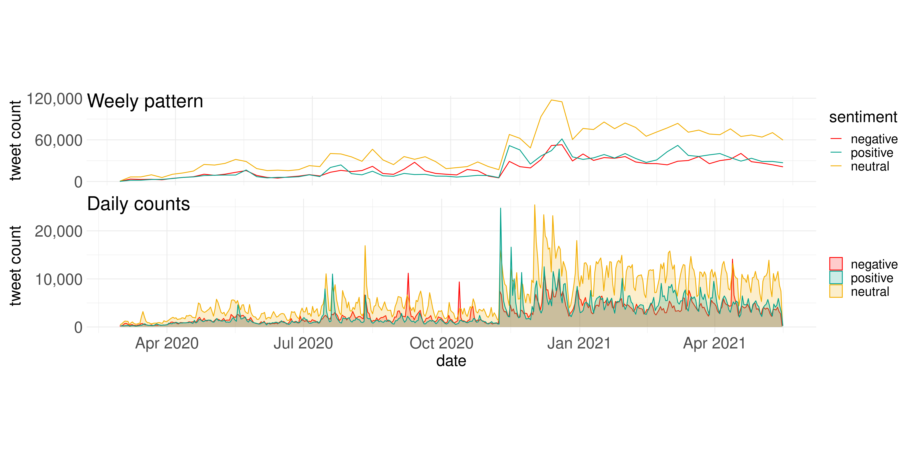
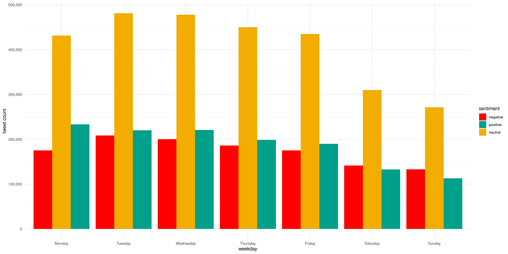
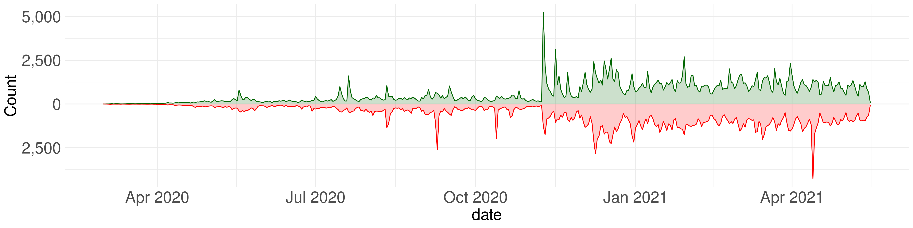
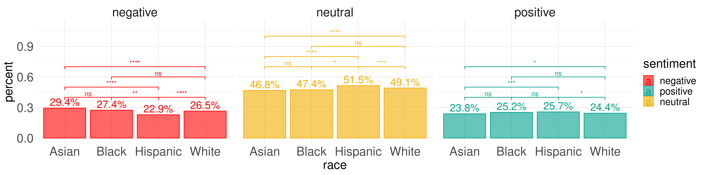
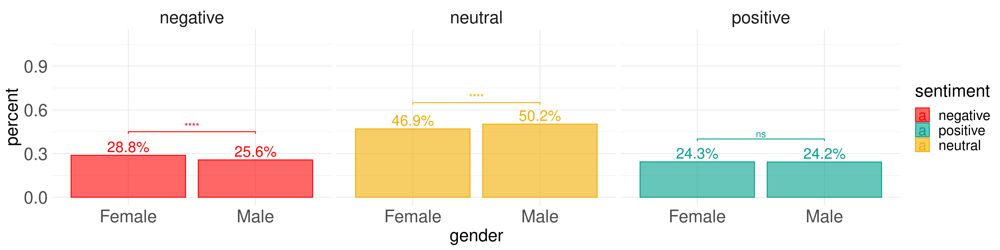
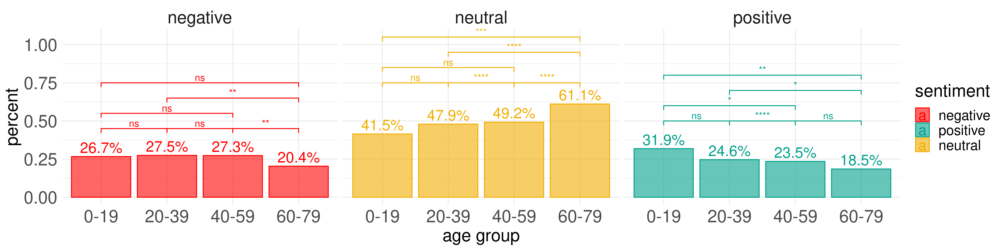

## Data source
The data is originally taken from the COVID-19 [Twitter data](http://www.panacealab.org/covid19/) from the Panacea Lab. The data are available from Jan, 2020 til today and they are continuously updating. The data used for this project span from March 1, 2020 to May 16, 2021. The data before March 2020 were not used since the there were very few discussion towards the COVID-19 vaccine before that. 

## Data cleaning
This is part of the my other larger research project, so I have already hydrated the tweets provided by the PanaceaLab. Sentiment analysis was performed to obtain the sentiments of each tweet. Demographic information (age, gender and race) were obtained through machine learning methods based on the users' profile names and profile images. Such information should not be regarded as 100% accurate but could be a good reference of the users. Conflicts were addressed before the analysis. Profile images are not available for every user, so the demographic information is only presented for part of the users. 

After cleaning, there were 5,385,383 tweets, correspond to 1,342,006 unique users. Demographic information is available to 53,592 users.

## Visualizations

```{r message=FALSE, warning=FALSE, include=FALSE}
library(tidymodels)
library(tidyverse)
library(pander)
```


### Sentiment trends over time

First I tried to reveal the overall distribution of the tweets. Starting from November 2020, more and more vaccine-related tweets were posted. To avoid the impact of weekday patterns, I visualized both the weekly patterns and the daily patterns. 


From the daily counts, we do see on some of the dates, there are spikes. So I searched the related news happened on those days. The following table reveals the top 10 days of tweet counts.
```{r, warning=FALSE, message=FALSE}
daily_count <- read_csv("data/processed/daily_count.csv")
top_10 <- daily_count %>% 
  mutate(weekday = weekdays(as.Date(date)),
         weekday = factor(weekday, 
                          levels = c('Monday', 'Tuesday', 'Wednesday', 'Thursday', 'Friday', 'Saturday', 'Sunday'))) %>% 
  head(10)
events = c("Pfizer, BioNTech say Covid vaccine is more than 90% effective",
           "First person (a 81-year-old lady) receives pfizer jab in UK",
           "A critical care nurse was the first person in New York and among the first people in the United States to get a shot of the coronavirus vaccine",
           "Ohio State first to roll out Johnson & Johnson COVID-19 vaccine (Mar 3)",
           "Vice President Pence, Top Lawmakers Get Pfizer’s Coronavirus Vaccine",
           "U.K. Approves Pfizer Coronavirus Vaccine, a First in the West",
           "People with a history of ‘significant’ allergic reactions shouldn’t have Pfizer vaccine, UK regulator warns",
           "Obama, Bush and Clinton would publicly get vaccinated to boost confidence",
           "Frontline health care workers receive historic COVID-19 vaccine",
           "AstraZeneca's COVID-19 vaccine has been approved for emergency supply in the UK")
top_10$events <- events
pander(top_10, justify = "left", caption = "Correlated events on the top 10 days of vaccine-related tweet counts")
```

### Weekday patterns

From the previous visualization, the dates with top tweet counts all happened on weekdays. In the next visualization, I tried to figure our the patterns during weekdays and weekends.



From the figure, we can tell that there are more vaccine-related tweets posted during the weekdays than weekends. Interestingly, there are more positive tweets than negative tweets during weekdays, while it is the opposite for weekends. The following table show the number of weeks when positive tweets than negative tweets.

```{r, message=FALSE}
n_pos_more_week <- read_csv("data/processed/n_pos_more_week.csv")
pander(n_pos_more_week)
```

Among the 64 weeks of the data, less than 20 weekends (Saturday or Sunday) had more positive tweets than negative tweets, where the numbers are larger during all the weekdays.

### Sentiment alternations


The figure shows on each given day, the number of users changed their sentiment towards vaccine. The green (upper) part shows the number of users changed their sentiment from negative to positive, while the red (lower) part shows the number of users changed their sentiment from positive to negative on a given day. From the figure, we may observe that on some dates, their are more users changed their attitude than other dates. To find out what might be the possible events trigger those sentiment alternation, I found the correlated events in tweets for top 10 days of sentiment alternation (both from negative to possive and from positive to negative).

```{r, message=FALSE}
sentiment_chg_daily_pn <- read_csv("data/processed/sentiment_chg_daily_pn.csv")
top_10_pos <- sentiment_chg_daily_pn %>% 
  mutate(weekday = weekdays(as.Date(date)),
         weekday = factor(weekday, 
                          levels = c('Monday', 'Tuesday', 'Wednesday', 'Thursday', 'Friday', 'Saturday', 'Sunday'))) %>% 
  arrange(desc(pos)) %>% 
  select(date, weekday, pos) %>% 
  head(10) %>% 
  mutate(count = pos,
         event = c(
    "Pfizer, BioNTech say Covid vaccine is more than 90% effective",
    "Moderna vaccine is nearly 95% effective",
    "Johnson & Johnson Vaccine Is 66% Effective In Preventing Moderate To Severe COVID-19",
    "Vice President Pence, Top Lawmakers Get Pfizer’s Coronavirus Vaccine",
    "A critical care nurse was the first person in New York and among the first people in the United States to get a shot of the coronavirus vaccine",
    "First person (a 81-year-old lady) receives pfizer jab in UK",
    "Pfizer-BioNTech announce positive results of pivotal Covid-19 vaccine study in adolescents",
    "Pfizer, BioNTech say Covid vaccine is more than 90% effective in first interim analysis from phase 3 study on Nov 9, 2020",
    "AstraZeneca announce US Phase III trial met primary efficacy endpoint in preventing COVID-19 at interim analysis",
    "FDA Says J&J's 1-Dose Vaccine Is Safe and Effective"
  )) %>% 
  select(-pos)
pander(top_10_pos, justify = "left", caption = "Switching from negative to positive")
```

```{r}
top_10_neg <- sentiment_chg_daily_pn %>% 
  mutate(weekday = weekdays(as.Date(date)),
         weekday = factor(weekday, 
                          levels = c('Monday', 'Tuesday', 'Wednesday', 'Thursday', 'Friday', 'Saturday', 'Sunday'))) %>%
  arrange(neg) %>% 
  select(date, neg, weekday) %>% 
  head(10) %>% 
  mutate(count = -neg,
         event = c(
    "The use of Johnson & Johnson vaccine is 'paused' because of a small number of reports of a rare and severe type of blood clot happening in people who got this vaccine.",
    "People with a history of ‘significant’ allergic reactions shouldn’t have Pfizer vaccine, UK regulator warns",
    "AstraZeneca Covid-19 vaccine study put on hold due to suspected adverse reaction in participant in the U.K.",
    "A head nurse at a hospital in US' Tennessee fainted during a press briefing. She had reportedly taken a COVID-19 vaccine shot prior to addressing the media.",
    "Wisconsin pharmacist who ‘intentionally’ spoiled more than 500 vaccine doses is arrested",
    "2 Alaska health care workers suffer reactions to Covid-19 vaccine",
    "Pfizer tells U.S. officials it cannot supply substantial additional vaccine until late June or July
Trump administration officials deny there will be availability issues.",
    "Italy prosecutors seize batch of AstraZeneca vaccine after death of man",
    "Johnson & Johnson Covid-19 vaccine study paused due to unexplained illness in participant",
    "FDA vaccine advisers worry about UK allergic reactions to Pfizer vaccine"
  )) %>% 
  select(-neg)
pander(top_10_neg, justify = "left", caption = "Switching from positive to negative")
```


### Sentiment proportions by sub-population

Visualizing the proportion the each sentiment with in each sub-population by race, gender and age group. Comparisons within sub-populations are tested by pairwised proportion test with FDR correction for multiple testing.







